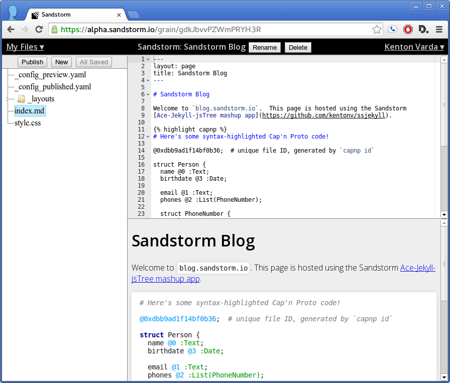

# Sandstorm-Jekyll-Ace-jsTree

This is a [Sandstorm](http://sandstorm.io) app originally created in one day.
It is primarily a mash-up of three things:

* [Jekyll](http://jekyllrb.com/), a tool for generating static sites from Markdown.
* [Ace](http://ace.c9.io/), a Javascript-based text editor.
* [jsTree](http://www.jstree.com/), a Javascript-based tree view widget.

Combining these three items, the app provides a browser-based CMS.  You can edit
your site's input files, see a live preview, and "publish" the site e.g. to
your domain name.

This app is available on the [Sandstorm App List](http://sandstorm.io/apps).

## Warning

This app is not currently "collaborative".  If multiple people try to access
the same app instance at the same time, they are very likely to overwrite each
other's changes. This is a limitation of the app, not of Sandstorm.
